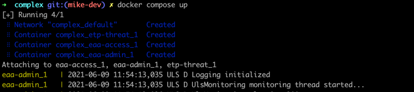
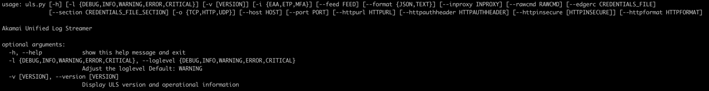
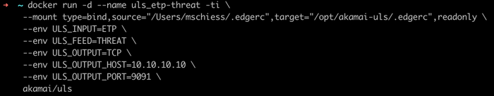

# Akamai Unified Log Streamer (ULS)

## Introduction

The Unified Log Streamer (ULS) is designed to simplify SIEM integrations for Akamai Secure Enterprise Access Products
- [Enterprise Application Access (EAA)](https://www.akamai.com/us/en/products/security/enterprise-application-access.jsp) 
- [Enterprise Threat Protector (ETP)](https://www.akamai.com/us/en/products/security/enterprise-threat-protector.jsp)
- [Akamai Phish-proof Multi Factor Authenticator (AKAMAI-MFA)](https://www.akamai.com/us/en/products/security/akamai-mfa.jsp)

Thanks to its modular design, ULS allows the connection of many SIEM solutions out-of-the-box.  
ULS can send data into any SIEM that supports either TCP, UDP or HTTP ingestion.  
It can be run directly as Python code, as a provided Docker container or through `docker compose` scripts.





## Table of contents
- [Akamai Unified Log Streamer (ULS)](#akamai-unified-log-streamer-uls)
  - [Introduction](#introduction)
  - [Table of contents](#table-of-contents)
  - [Key Features](#key-features)
  - [Documentation](#documentation)
    - [Command Line Usage](#command-line-usage)
    - [Docker](#docker)
    - [Docker-compose](#docker-compose)
  - [Development](#development)
  - [Support](#support)
  - [LINKS / REFERENCES](#links--references)

## Key Features

- Supported Inputs (Secure Enterprise Access Products)
    - [Enterprise Application Access (EAA)](https://www.akamai.com/us/en/products/security/enterprise-application-access.jsp)
      - [ACCESS](docs/LOG_OVERVIEW.md#access-logs-access) 
      - [ADMIN](docs/LOG_OVERVIEW.md#admin-logs-admin)
      - [CONHEALTH](docs/LOG_OVERVIEW.md#connector-health-conhealth)
    - [Enterprise Threat Protectors (ETP)](https://www.akamai.com/us/en/products/security/enterprise-threat-protector.jsp)
      - [THREAT](docs/LOG_OVERVIEW.md#threat-log-threat)
      - [AUP](docs/LOG_OVERVIEW.md#accceptable-use-policy-logs-aup)
      - [DNS](docs/LOG_OVERVIEW.md#dns)
      - [PROXY](docs/LOG_OVERVIEW.md#proxy)
    - [Akamai Phish-proof Multi Factor Authenticator (AKAMAI-MFA)](https://www.akamai.com/us/en/products/security/akamai-mfa.jsp)
      - [AUTH](docs/LOG_OVERVIEW.md#authentication-logs-auth)
      - [POLICY](docs/LOG_OVERVIEW.md#policy-logs-policy)
  

- Supported data outputs
    - TCP Socket (tcp://host:port) `--output tcp`
    - UDP Socket (udp://host:port) `--output udp`
    - HTTP(S) URL (http(s)://host:port/path) (supporting Authentication) `--output http`
    - RAW (>STDOUT) `--output raw`


- Operation types
    - [python (command line)](./docs/COMMAND_LINE_USAGE.md)
    - [docker](./docs/DOCKER_USAGE.md)
    - [docker-compose](./docs/DOCKER-COMPOSE_USAGE.md)
 

- Additional Features
    - [Monitoring output](./docs/MONITORING.md)
    - Debug information (log level adjustment)
    - HTTP CA CERT verification skipping
    - Adoptable HTTP - POST format
    - [Output filter](docs/ADDITIONAL_FEATURES.md#filter---filter-feature) (to reduce number of log lines sent to SIEM)
  
## Documentation
ULS can be operated in many ways.  
Before setting up ULS, please understand your SIEM ingestion capabilities and configure an ingest method on your SIEM.
More information for specific SIEM solutions can be found in [this directory](./docs/SIEM/SIEM_OVERVIEW.md) and in your SIEM documentation.

### Generic Requirements
- Python 3.9+ OR docker / docker-compose 
- AKAMAI .edgerc file ([see further documentation here](docs/AKAMAI_API_CREDENTIALS.md))
- Outbound Internet access (Akamai API, Dockerhub OR Python repositories)


### Command Line Usage
  
Example commands:
```bash
# ETP - THREAT to console
python3.9 bin/uls.py --input etp --feed threat --output raw

# EAA - ACCESS to TCP
python3.0  bin/uls.py --input eaa --feed access -output tcp --host 10.99.10.99 --port 8081
```
For more information, please visit [this document](./docs/COMMAND_LINE_USAGE.md)

### Docker
  
For more information, please visit [this document](./docs/DOCKER_USAGE.md)

### Docker-compose
  
For more information, please visit [this document](./docs/DOCKER-COMPOSE_USAGE.md)


## Development

For the latest stable version of this software, please check the [release section](https://github.com/akamai/uls/releases) of the repo. The `main` [branch](https://github.com/akamai/uls) will retain the stable versions.
To ensure a continuous development of this tool, all new updates will go into the `development` [branch](https://github.com/akamai/uls/tree/development) of this repo.  
The `development` branch can be subject to change and could also represent a broken version of this software.
In parallel, all new versions within the "main" branch will also be available on the [ULS docker hub space](https://hub.docker.com/repository/docker/akamai/uls).

Contributions to this software can be provided via [Pull Requests](https://docs.github.com/en/github/collaborating-with-pull-requests/proposing-changes-to-your-work-with-pull-requests/about-pull-requests) and will get merged after successful review. 

## Support

Akamai ULS is provided "as-is". It is not supported by Akamai Support. Akamai is neither liable for the function nor for any caused problems that come along with the usage or caused by this tool. Please refer to the [LICENSE](./LICENSE) document for more information.

To report an issue, feature request or bug, please open a new issue into the [GitHub Issues page](https://github.com/akamai/uls/issues).
This software is released under the "Apache License". Please read the [frequently asked questions](docs/FAQ.md) and visit the [debugging instructions](./docs/DEBUGGING.md) before opening a bug request.  

[Pull requests](#development) to improve the code or enhance the functionality are welcome.

## LINKS / REFERENCES
[The ULS Project on GitHub](https://github.com/akamai/uls)  
[The ULS Project on Dockerhub](https://hub.docker.com/r/akamai/uls)
