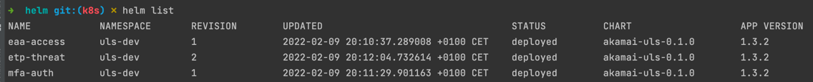

# Akamai Unified Log Streamer (ULS)

## Introduction

The Unified Log Streamer (ULS) is designed to simplify SIEM integrations for Akamai Secure Enterprise Access Products
- [Enterprise Application Access (EAA)](https://www.akamai.com/us/en/products/security/enterprise-application-access.jsp) 
- [Secure Internet Access Enterprise (SIA)](https://www.akamai.com/us/en/products/security/enterprise-threat-protector.jsp)
- [Akamai MFA (MFA)](https://www.akamai.com/us/en/products/security/akamai-mfa.jsp)
- [Guardicore Micro Segmentation](https://www.akamai.com/lp/guardicore)
- [Akamai Cloud (Linode)](https://www.linode.com/)
- [Akamai Control Center logs (ACC)](https://techdocs.akamai.com/control-ctr/docs/welcome-cc)

Thanks to its modular design, ULS allows the connection of many SIEM solutions out-of-the-box.  
ULS can send data into any SIEM that supports either file, TCP, UDP, HTTP or FILE ingestion.  

ULS can be run directly as Python code, as a Docker container, through `docker compose` scripts or through helm within kubernetes.  
Running ULS on Windows (python) is also supported (but not extensively tested, yet).


## Table of contents<!-- omit in toc -->
- [Akamai Unified Log Streamer (ULS)](#akamai-unified-log-streamer-uls)
  - [Introduction](#introduction)
  - [Key Features](#key-features)
  - [Documentation](#documentation)
    - [Generic Requirements](#generic-requirements)
    - [Command Line Usage](#command-line-usage)
    - [Docker](#docker)
    - [Docker-compose](#docker-compose)
    - [Kubernetes](#kubernetes)
  - [Development](#development)
  - [Changelog](#changelog)
  - [Support](#support)
  - [LINKS / REFERENCES](#links--references)

## Key Features

### Supported products and feeds
| Supported Product                                                                                                                                           | Available Feeds                                                                                                                                                                                                                                                                                 |
|-------------------------------------------------------------------------------------------------------------------------------------------------------------|-------------------------------------------------------------------------------------------------------------------------------------------------------------------------------------------------------------------------------------------------------------------------------------------------|
| [Enterprise Application Access (EAA)](https://www.akamai.com/us/en/products/security/enterprise-application-access.jsp)                                     | [ACCESS](docs/LOG_OVERVIEW.md#access-logs-access)<br>[ADMIN](docs/LOG_OVERVIEW.md#admin-logs-admin)<br>[CONHEALTH](docs/LOG_OVERVIEW.md#connector-health-conhealth)<br>[DEVINV](docs/LOG_OVERVIEW.md#device-inventory-devinv)<br>[DIRHEALTH](docs/LOG_OVERVIEW.md#directory-health-dirhealth)   |
| [Secure Internet Access Enterprise (SIA)<br>(Enterprise Threat Protector - ETP)](https://www.akamai.com/products/secure-internet-access-enterprise) | [THREAT](docs/LOG_OVERVIEW.md#threat-log-threat)<br>[AUP](docs/LOG_OVERVIEW.md#accceptable-use-policy-logs-aup)<br>[DNS](docs/LOG_OVERVIEW.md#dns)<br>[PROXY](docs/LOG_OVERVIEW.md#proxy)<br>[NETCON](docs/LOG_OVERVIEW.md#netcon)                                                              |
| [Akamai Phish-proof Multi Factor Authenticator (AKAMAI-MFA)](https://www.akamai.com/us/en/products/security/akamai-mfa.jsp)                                 | [EVENT](docs/LOG_OVERVIEW.md#authentication-logs-auth)                                                                                                                                                                                                                                          |
| [Akamai Guardicore Segmentation](https://www.akamai.com/lp/guardicore)                                                                                      | [NETLOG](docs/LOG_OVERVIEW.md#netlog)<br>[INCIDENT](docs/LOG_OVERVIEW.md#incident)<br>[AGENT](docs/LOG_OVERVIEW.md#gc-agent)<br>SYSTEM<br>[AUDIT](docs/LOG_OVERVIEW.md#gc-audit)                                                                                                                |
| [Linode](https://www.linode.com/) (beta)                                                                                                                    | [AUDIT](docs/LOG_OVERVIEW.md#audit-logs)<br>[UTILIZATION](docs/LOG_OVERVIEW.md#utilization)                                                                                                                                                                                                     |
| Akamai Control Center (experimental)                                                                                                                        | [EVENTS](docs/LOG_OVERVIEW.md#events)                                                                                                                                                                                                                                                           |

  
### Supported data outputs

- [`TCP` Socket (tcp://host:port) `--output tcp`](docs/OUTPUTS.md#tcp--udp)
- [`UDP` Socket (udp://host:port) `--output udp`](docs/OUTPUTS.md#tcp--udp)
- [`HTTP` and `HTTPS` URL (http(s)://host:port/path) (supporting Authentication) `--output http`](docs/OUTPUTS.md#http-and-https)
- [`RAW` (>STDOUT) `--output raw`](docs/OUTPUTS.md#raw)
- [`FILE` (writes log to a file on the local filesystem and rotates them) `--output file`](docs/OUTPUTS.md#file)  
The full output documentation can be found [here](docs/OUTPUTS.md).
  

### Types of Operations
- [python (command line)](./docs/COMMAND_LINE_USAGE.md)
- [docker](./docs/DOCKER_USAGE.md)
- [docker-compose](./docs/DOCKER-COMPOSE_USAGE.md)
- [kubernetes / k8s](./docs/KUBERNETES_USAGE.md)
 

### Additional Features
- [Monitoring output](./docs/MONITORING.md)
- Debug information (log level adjustment)
- HTTP CA CERT verification skipping
- Adoptable HTTP - POST format
- [Output filter](docs/ADDITIONAL_FEATURES.md#filter---filter-feature) (to reduce number of log lines sent to SIEM)
- [Output transformation](docs/TRANSFORMATIONS.md) (to produce other log formats i.e. for 3rd party integrations)
- [Auto - Resume](./docs/ADDITIONAL_FEATURES.md#autoresume--resume)
- [File - Post Processing](./docs/ADDITIONAL_FEATURES.md#post-processing-of-files-fileoutput-only)
  
## Documentation
ULS can be operated in many ways.  
Before setting up ULS, please understand your SIEM ingestion capabilities and configure an ingestion method on your SIEM.  
ULS is designed as an abstraction layer to easily ship log data to most SIEMs on the market. It does not create any dashboards / data extractions.  
Anyway, details for some specific SIEM solutions can be found in [this directory](./docs/SIEM/SIEM_OVERVIEW.md) and in your SIEM documentation.

### Generic Requirements
- Python 3.9+ OR docker / docker-compose OR kubernetes / helm
- AKAMAI .edgerc file ([see further documentation here](docs/AKAMAI_API_CREDENTIALS.md))
- Outbound Internet access (Akamai API, Dockerhub OR Python repositories)
- Compute resource footprint is minimal: 1 vCPU, 1 GB RAM, 500 MB free disk. See also [High availability](docs/HIGH_AVAILABILITY.md) doc.
- NTP synchronized time on the OS ULS will be executed.

### Command Line Usage
  
Example commands:
```bash
# ETP - THREAT to console
python3.9 bin/uls.py --input etp --feed threat --output raw

# EAA - ACCESS to TCP
python3.9  bin/uls.py --input eaa --feed access --output tcp --host 10.99.10.99 --port 8081
```
For more information, please visit [this document](./docs/COMMAND_LINE_USAGE.md)

### Docker
  
For more information, please visit [this document](./docs/DOCKER_USAGE.md)

### Docker-compose
  
For more information, please visit [this document](./docs/DOCKER-COMPOSE_USAGE.md)

### Kubernetes
  
For more information, please visit [this document](./docs/KUBERNETES_USAGE.md)

## Development

For the latest stable version of this software, please check the [release section](https://github.com/akamai/uls/releases) of the repo. The `main` [branch](https://github.com/akamai/uls) will retain the stable versions.
To ensure a continuous development of this tool, all new updates will first go into the `development` [branch](https://github.com/akamai/uls/tree/development) of this repo.  
The `development` branch can be subject to change and could also represent a broken version of this software.
In parallel, all new versions within the "main" branch will also be available on the [ULS docker hub space](https://hub.docker.com/repository/docker/akamai/uls).

Contributions to this software can be provided via [Pull Requests](https://docs.github.com/en/github/collaborating-with-pull-requests/proposing-changes-to-your-work-with-pull-requests/about-pull-requests) and will get merged after successful review. 

## Changelog

Find a full Changelog of all added Features and fixed Bugs here:  
[ULS - Changelog](./docs/CHANGELOG.md)

## Support

Akamai **ULS is provided "as-is"**. It is not supported by Akamai Support. Akamai is neither liable for the function nor for any caused problems that come along with the usage or caused by this tool. Please refer to the [LICENSE](./LICENSE) document for more information.

To report an issue, feature request or bug, please open a new issue into the [GitHub Issues page](https://github.com/akamai/uls/issues).
This software is released under the "Apache License". Please read the [frequently asked questions](docs/FAQ.md) and visit the [troubleshooting and debugging instructions](./docs/DEBUGGING.md) before opening a ticket.  

[Pull requests](#development) to improve the code or enhance the functionality are welcome.

## LINKS / REFERENCES

[The ULS Project on GitHub](https://github.com/akamai/uls)  
[The ULS Project on Dockerhub](https://hub.docker.com/r/akamai/uls)

## Stargazers over time
A small graph to show how many stars we collected over the time of this project.
Feel free to add your star as well.  
[](https://starchart.cc/akamai/uls)

