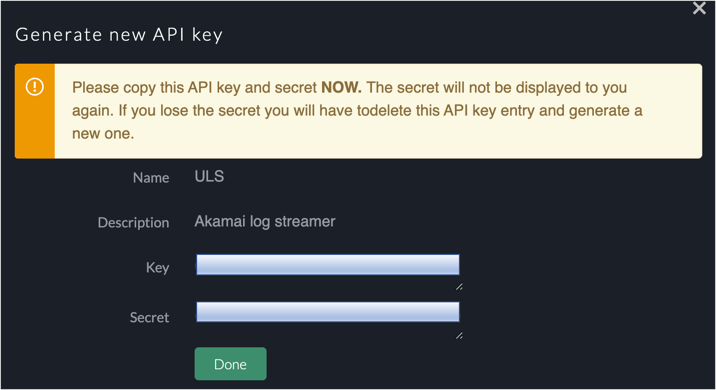
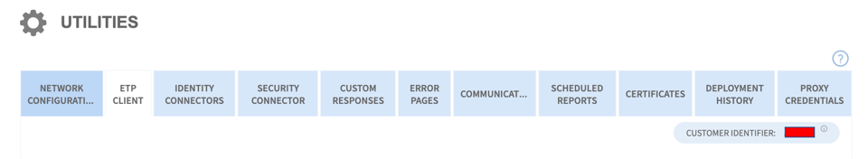

# AKAMAI API CREDENTIALS
This document describes the creation and usage of AKAMAI API credentials for the different products and streams

### Overview
- [Feed / API overview](#feed--api-overview)
- [Credential Creation](#credential-creation)
    - [EAA](#eaa)
    - [ETP](#etp)
    - [MFA](#mfa)
- [EdgeRC File](#edgerc-file)
    - [Multiple Contracts](#multiple-customer-contracts)
    - [Partner & employee enhancement](#partner--employee-enhancement)

## Feed / API overview
|Product|Feed|API|
|---|---|---|
|EAA|ACCESS|EAA LEGACY API|
|EAA|ADMIN|EAA LEGACY API|
|EAA|HEALTH|EAA OPEN API|
|ETP|THREAT|ETP OPEN API V2|
|ETP|AUP|ETP OPEN API V2|
|MFA|AUTH|MFA INTEGRATION API|
|MFA|POLCIY|MFA INTEGRATION API|


## Credential Creation
### EAA 
#### EAA LEGACY API (Admin / Access logs)
To create **EAA Legacy API** credentials, connect to [Akamai Control Center](https://control.akamai.com)
- Select "Enterprise Application Access" from the main navigation menu on the left
- Navigate to System > Settings
- Click Generate new API Key in the API section of the page
- Enter a name and a description
- Copy the Key and the secret

- Add/replace/amend the following section to your `.edgerc` file and replace the data accordingly:
    ```text
    [default]
    ; [OPTIONAL] EAA Legacy API used by the 'akamai eaa log' command
    eaa_api_host = manage.akamai-access.com
    eaa_api_key = XXXXXXXX-XXXX-XXXX-XXXX-XXXXXXXXXXXXX
    eaa_api_secret = XXXXXXXX-XXXX-XXXX-XXXX-XXXXXXXXXXXXX
    ```

#### EAA OPEN API (Health logs)
To create **AKAMAI {OPEN} API** credentials, please follow [these instructions](https://developer.akamai.com/legacy/introduction/Prov_Creds.html).  
Make sure the API user has **READ-WRITE** permission to the **Enterprise Application Access** API.  
For ULS usage, it is safe to provide all required roles (such as EAA, ETP) to a single api user.

Please add/replace/amend the following section to your `.edgerc` file and replace the data accordingly:
```text
[default]
; Akamai {OPEN} API credentials
host = akaa-xxxxxxxxxxxxxxxx-xxxxxxxxxxxxxxxx.luna.akamaiapis.net
client_token = akab-xxxxxxxxxxxxxxxx-xxxxxxxxxxxxxxxx
client_secret = xxxxxxxxxxxxxxxxxxxxxxxxxxxxxxxxxxxxxxxxxxxx
access_token = akab-xxxxxxxxxxxxxxxx-xxxxxxxxxxxxxxxx
```

### ETP
#### ETP OPEN API V2
To create **AKAMAI {OPEN} API** credentials, please follow [these instructions](https://developer.akamai.com/legacy/introduction/Prov_Creds.html).  
Make sure the API user has **READ-WRITE** permission to the **etp-config** API
For ULS usage, it is safe to provide all required roles (such as EAA, ETP) to a single api user.

For ETP usage, an additional config value (**etp_config_id**) is required.
The `etp_config_id` value can be obtained as follows:
- Connect to [Akamai Control Center](https://control.akamai.com)
- Select "Enterprise Threat Protector" from the main navigation menu on the left
- Navigate to "Utilities" -> "ETP Client" Tab
- Locate customer identifier on the right


Please add/replace/amend the following section to your `.edgerc` file and replace the data accordingly:
```text
[default]
; Akamai {OPEN} API credentials
host = akaa-xxxxxxxxxxxxxxxx-xxxxxxxxxxxxxxxx.luna.akamaiapis.net
client_token = akab-xxxxxxxxxxxxxxxx-xxxxxxxxxxxxxxxx
client_secret = xxxxxxxxxxxxxxxxxxxxxxxxxxxxxxxxxxxxxxxxxxxx
access_token = akab-xxxxxxxxxxxxxxxx-xxxxxxxxxxxxxxxx

; ETP Config ID (required for ETP usage, can be obtained from the Akamai Web Interface)
etp_config_id = your-ETP-config-ID
```

### MFA
#### MFA INTEGRATION API
To create **MFA INTEGRATION API** credentials, connect to [Akamai Control Center](https://control.akamai.com).
- Select "Enterprise Center" from the main navigation menu on the left
- Navigate to MFA -> Integrations 
- Click on (+) to add a new integration
    
- Confirm by clicking the "Save & Deploy" button
- Copy the credentials shown
    
- Add/replace/amend the following section to your `.edgerc` file and replace the data accordingly:
    ```text
    [default]
    mfa_integration_id = app_xxxxxxxxxxxxxxxxxxxxx
    mfa_signing_key = xxxxxxxxxxxxxxxxxxxxxxxxxxxxxxxxxxxxxxxxxxxxx
    ```


## EDGERC File
The .edgerc file hosts all relevant credentials required by ULS (and CLI's). Some basic information around .edgerc can be found [here](https://developer.akamai.com/legacy/introduction/Conf_Client.html).
This repo also provides a [.edgerc sample file](examples/.edgerc-sample) with all config sections added and explained.
Feel free to use the file as a template and comment out the sections not needed with `;`. 


### Advanced .edgerc Usage 
#### Multiple customer contracts
If your organization has multiple contracts, please add the following "contract_id" line to your `.edgerc` file in order select the proper contract.  
If ETP and EAA are on different contracts, we recommend the creation of two different `.edgerc` files.
```text
; If your organization have multiple contracts with EAA service
; please add it below. Contact your Akamai representative to obtain it
contract_id = A-B-1CD2E34
```

#### Partner & employee enhancement
For Partners or AKAMAI employees please add the "extra_qs" line to your `.edgerc` file in order to switch towards the desired tenant. Please replace "TENANT-SWITCH-KEY" with the provided switch key.
```text
; If you are a partner managing multiple customers, you can use the switchkey
; For more information, see:
; https://learn.akamai.com/en-us/learn_akamai/getting_started_with_akamai_developers/developer_tools/accountSwitch.html
extra_qs = accountSwitchKey=TENANT-SWITCH-KEY
```