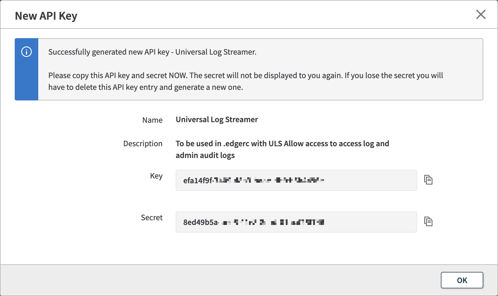
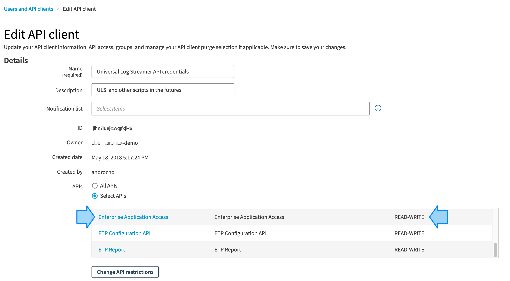
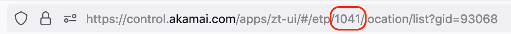
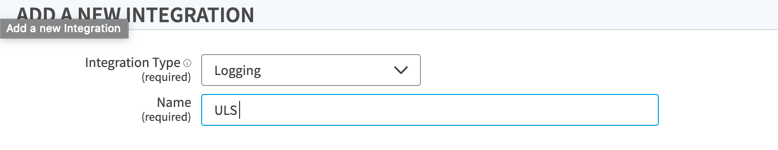
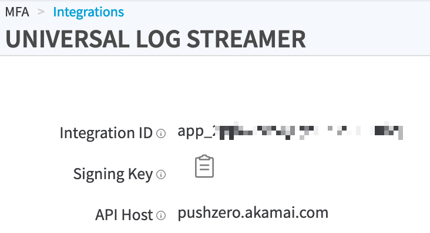

# Configure Akamai API credentials for ULS<!-- omit in toc -->

This document describes how to create Akamai API credentials and configure them in Unified Log Streamer (ULS) to access the different Akamai products and data feeds.

## Table of contents<!-- omit in toc -->

- [Feeds / API overview](#feeds--api-overview)
- [Setting up API credentials for ULS](#setting-up-api-credentials-for-uls)
  - [Enterprise Application Access (EAA)](#enterprise-application-access-eaa)
    - [EAA Legacy API (for Access and Admin Audit feeds)](#eaa-legacy-api-for-access-and-admin-audit-feeds)
    - [EAA {OPEN} API (for Connector Health feed)](#eaa-open-api-for-connector-health-feed)
  - [Enterprise Threat Protector (ETP)](#enterprise-threat-protector-etp)
    - [ETP {OPEN} API Reporting](#etp-open-api-reporting)
  - [Akamai MFA](#akamai-mfa)
    - [MFA Integration for logging](#mfa-integration-for-logging)
  - [Guardicore](#guardicore)
    - [Guardicore API Integration](#guardicore-api-integration)
  - [Linode](#linode)
    - [Linode API Token](#linode-api-credentials)
- [Advanced .edgerc usage](#advanced-edgerc-usage)
  - [Multiple customer contracts](#multiple-customer-contracts)
  - [Partner & employee enhancement](#partner--employee-enhancement)
  - [ETP API EVENT Filters](#etp-api-event-filters)

## Feeds / API overview

|Product long name|Acronym| Feed(s)                         | API                                                                                   |
|---|---|---------------------------------|---------------------------------------------------------------------------------------|
|Enterprise Application Access|EAA| ACCESS, ADMIN                   | [EAA Legacy API](#eaa-legacy-api-for-access-and-admin-audit-feeds)                    |
|Enterprise Application Access|EAA| HEALTH                          | [{OPEN} API / Enterprise Application Access](#eaa-open-api-for-connector-health-feed) |
|Enterprise Threat Protector|ETP| THREAT, AUP, DNS, PROXY         | [{OPEN} API / ETP Report](#etp-open-api-reporting)                                    |
|Akamai MFA|MFA| EVENTS                          | [MFA Integration](#mfa-integration-for-logging)                                       |
|Guardicore|GC| NETLOG, INCIDENT, AGENT, SYSTEM | [Guardicore API Integration](#guardicore-api-integration)                             |
|Linode|LN| AUDIT                           | [Linode API Credentials](#linode-api-credentials) |                       

## Setting up API credentials for ULS

ULS will read the API credentials from a text file, by default named `.edgerc` and stored in the home directory of the current user. The credentials configuration file can have multiple sections allowing to use multiple tenants (in case of multi-contract structure, or Akamai Partner).

Some basic information around `.edgerc` can be found [here](https://developer.akamai.com/legacy/introduction/Conf_Client.html).
This repo also provides a [.edgerc sample file](examples/edgerc-sample) with all config sections added and explained.

Feel free to use the file as a template and comment out the sections not needed with `;`.

You'll find below all the details how to create the credentials based on the Akamai Data you plan to use with ULS.

### Enterprise Application Access (EAA) 

#### EAA Legacy API (for Access and Admin Audit feeds)

To create **EAA Legacy API** credentials, connect to [Akamai Control Center](https://control.akamai.com)

- Select **Enterprise Center** from the main navigation menu on the left
- Navigate to **General Settings** > **Settings**
- Select the **API Keys** tab
- Click **Generate new API Key** top right button
- Enter a name and a description
- On the confirmation screen, copy the **Key** and the **Secret**:  
- 
- Add/replace/amend the following section to your `.edgerc` file and replace the data accordingly, example in the default section:
  
```INI
[default]
; API credentials for EAA access and admin logs
eaa_api_host = manage.akamai-access.com
eaa_api_key = XXXXXXXX-XXXX-XXXX-XXXX-XXXXXXXXXXXXX
eaa_api_secret = XXXXXXXX-XXXX-XXXX-XXXX-XXXXXXXXXXXXX
```

#### EAA {OPEN} API (for Connector Health feed)

To create **Akamai {OPEN} API** credentials, please follow [these instructions](https://developer.akamai.com/legacy/introduction/Prov_Creds.html).

Make sure the API user has `READ-WRITE` permission on the **Enterprise Application Access** API. For ULS usage, it is safe to provide all required API permission (such as EAA, ETP) to a single API user.



Please add/replace/amend the following section to your `.edgerc` file and replace the data accordingly, example in the default section:

```INI
[default]
; Akamai {OPEN} API credentials
host = akaa-xxxxxxxxxxxxxxxx-xxxxxxxxxxxxxxxx.luna.akamaiapis.net
client_token = akab-xxxxxxxxxxxxxxxx-xxxxxxxxxxxxxxxx
client_secret = xxxxxxxxxxxxxxxxxxxxxxxxxxxxxxxxxxxxxxxxxxxx
access_token = akab-xxxxxxxxxxxxxxxx-xxxxxxxxxxxxxxxx
```

### Enterprise Threat Protector (ETP)

#### ETP {OPEN} API Reporting

To create **AKAMAI {OPEN} API** credentials, please follow [these instructions](https://developer.akamai.com/legacy/introduction/Prov_Creds.html).

Make sure the API user has **READ-WRITE** permission to the **etp-config** API
For ULS usage, it is safe to provide all required roles (such as EAA, ETP) to a single api user.

For ETP usage, an additional config value (**etp_config_id**) is required.
The `etp_config_id` value can be obtained as follows:
- Connect to [Akamai Control Center](https://control.akamai.com)
- Select **Enterprise Center**
- Select **Locations** > **Locations** (or any other ETP specific page)
- Check out the URL bar of your browser, locate your **ETP configuration identifier** between `/etp/` and `/location/`:


Please add/replace/amend the following section to your `.edgerc` file and replace the data accordingly:
```INI
[default]
; Akamai {OPEN} API credentials
host = akaa-xxxxxxxxxxxxxxxx-xxxxxxxxxxxxxxxx.luna.akamaiapis.net
client_token = akab-xxxxxxxxxxxxxxxx-xxxxxxxxxxxxxxxx
client_secret = xxxxxxxxxxxxxxxxxxxxxxxxxxxxxxxxxxxxxxxxxxxx
access_token = akab-xxxxxxxxxxxxxxxx-xxxxxxxxxxxxxxxx

; ETP Config ID (required for ETP usage, can be obtained from the Akamai Web Interface)
etp_config_id = your-ETP-config-ID
```

### Akamai MFA

#### MFA Integration for logging

To create **MFA Integration** credentials, connect to [Akamai Control Center](https://control.akamai.com).

- Select **Enterprise Center** from the main navigation menu on the left
- Navigate to **MFA** > **Integrations**
- Click on (+) to add a new MFA integration:  
  
- Confirm by clicking the **Save & Deploy** button
- **Copy** the credentials as shown below:  
  
- Add/replace/amend the following section to your `.edgerc` file and replace the data accordingly:

```INI
[default]
; Akamai MFA logging integration credentials
mfa_integration_id = app_xxxxxxxxxxxxxxxxxxxxx
mfa_signing_key = xxxxxxxxxxxxxxxxxxxxxxxxxxxxxxxxxxxxxxxxxxxxx
```

### Guardicore

#### Guardicore API Integration
Guardicore is using the portal users for API access. Therefore it is recommended to create a "read only" (= GUEST role) user within Centra Administration.
- Go to Administration
- Select "Users" in the left navigation tree
- Click the "Create User" button
- Enter a username and a password, select "Guest" as permission scheme
- Confirm by clicking the SAVE button
- Now logout and login with the newly created user and follow tha password change procedure
- Note down your guardicore Adminsitration (=API) url without https
- Add/replace/amend the following section to your `.edgerc` file and replace the data accordingly:

```INI
[default]
; Guardicore integration credentials
gc_hostname = your_hostname.guardicore.com          # Do not prepend https://
gc_username = XXXXXXXXXXXX
gc_password = XXXXXXXXXXXXX
```

### Linode
#### Linode API Credentials
- Login into your linode cloud console
- Click on your user name on the top right
- Select API Tokens
- Create a personal Access Token
- Enter a Label and select all privleges to "READ ONLY"
- Set expiry to your needs
- Confirm by clicking the CREATE TOKEN button
- Copy the token provided in the next field
- Add/replace/amend the following section to your `.edgerc` file and replace the data accordingly:
```INI
[default]
; Guardicore integration credentials
linode_hostname = your_hostname.guardicore.com          # Do not prepend https://
linode_token = XXXXXXXXXXXX
```
## Advanced .edgerc usage

### Multiple customer contracts

If your organization has multiple contracts, please add the following "contract_id" line to your `.edgerc` file in order select the proper contract.  
If ETP and EAA are on different contracts, we recommend the creation of two different `.edgerc` files.

```INI
[default]
; If your organization have multiple contracts with EAA service
; please add it below. Contact your Akamai representative to obtain it
contract_id = A-B-1CD2E34
```

### Partner & employee enhancement

For Partners or AKAMAI employees please add the "extra_qs" line to your `.edgerc` file in order to switch towards the desired tenant. Please replace "TENANT-SWITCH-KEY" with the provided switch key.

```INI
[default]
; If you are a partner managing multiple customers, you can use the switchkey
; For more information, see:
; https://learn.akamai.com/en-us/learn_akamai/getting_started_with_akamai_developers/developer_tools/accountSwitch.html
extra_qs = accountSwitchKey=TENANT-SWITCH-KEY
```

### ETP API EVENT Filters

For Enterprise Threat protector (ETP), events can already be filtered at API level, so they won't even be transferred towards ULS.
This can be used for performance / scaling as well for cost saving reasons.
Please find more information around filtering on ETP API in the [ETP APIv3 documentation](https://developer.akamai.com/api/enterprise_security/enterprise_threat_protector_reporting/v3.html#filter)

```INI
[default]
etp_event_filters = {"list":{"nin":["12345"]}}
```
