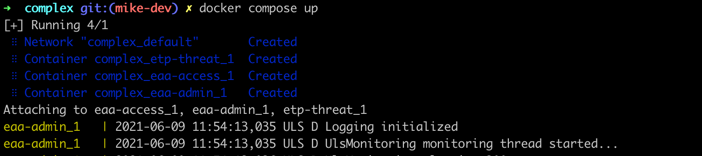

# ULS Docker-Compose Usage
This document describes the "docker compose" of the ULS software.  
All commands referenced in this document are run from the repositories root level.  
The `docker compose` command used in this doc, was recently integrated into the docker cli (currently beta). Nevertheless, all of the `docker-compose`commands will work as well. 

  

### Table of contents
- [Requirements](#requirements)
- [Installation](#installation)
  - [Obtaining the Docker image](#obtaining-the-docker-image)
  - [Setup the .EDGERC File](#setup-the-edgerc-file)
- [Usage](#usage)

## Requirements
- [Docker](https://www.docker.com/) needs to be installed on an **linux** OS (Windows not supported)
- [docker-compose](https://docs.docker.com/compose/install/) needs to be installed alongside docker  
  As alternative to the above, you can now use the latest docker cli with the command `docker compose`
- Access to the docker image (see [Installation](#installation) section)
- Akamai API credentials file - `.edgerc` (see [API Credentials](AKAMAI_API_CREDENTIALS.md) for creation instructions)
- Understanding of available [ULS Environmental Variables](ARGUMENTS_ENV_VARS.md)

## Installation
### Obtaining the Docker image
please see the ["Obtaining the Docker image" section in the Docker_Usage file](DOCKER_USAGE.md#obtaining-the-docker-image).

## Setup the .EDGERC File
Make sure you refer the path to your `.edgerc` file  ([instructions for creation](AKAMAI_API_CREDENTIALS.md)) within the `.env` files.

## Usage
Docker compose is the recommended way to run AKAMAI ULS in a production environment.  
Docker compose enables the definition of multiple parallel uls instances providing different data to multiple ingestion points.

To start the docker-compose script please run the following:
```bash
cd docker-compose/simple
docker compose up
```


In order to run the docker-compose as DAEMON in the background, use the following command
  ```bash
cd docker-compose/simple
docker compose up -d
  ```

### Usage Examples
- Simple docker-compose setup that will ship ETP-THREAT events via TCP
  ```bash
  cd docker-compose/simple
  docker compose up
  ```
  This will run the "simple" use case in foreground. 
  The `docker-compose.yml` file will reference the `etp-threat.env` and provide the configuration from that file.  
  **Files:**  
    - [docker-compose.yml](examples/docker-compose/simple/docker-compose.yml)
    - [etp-threat.env](examples/docker-compose/simple/etp-threat.env)

  
- Complex docker-compose setup delivering different streams to different endpoints
  ```bash
  cd docker-compose/complex
  docker compose up
  ```
  This triggers a more complex setup consisting out of 3 different data feeds.  
  **Files:**  
    - [docker-compose.yml](examples/docker-compose/complex/docker-compose.yml)
    - [etp-threat.env](examples/docker-compose/complex/etp-threat.env)
    - [eaa-admin.env](examples/docker-compose/complex/eaa-access.env)
    - [mfa.env](examples/docker-compose/complex/mfa.env)