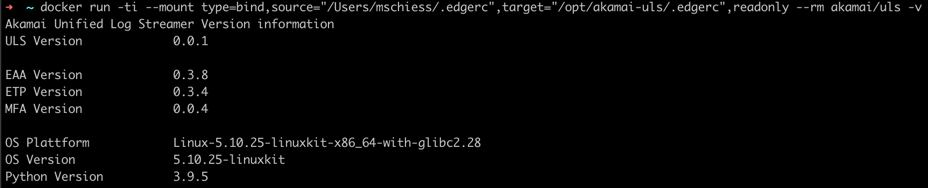

# ULS Docker Usage
This document describes the "docker" of the ULS software.  
All commands referenced in this document are run from the repositories root level.  
    

### Overview
- [ULS Docker Usage](#uls-docker-usage)
    - [Overview](#overview)
  - [Requirements](#requirements)
  - [Installation](#installation)
  - [Usage](#usage)

## Requirements
- [Docker](https://www.docker.com/) needs to be installed on an **GNU/Linux** OS
  - Note: Windows is not supported, please use HyperV with a Linux VM
- Access to the docker image (see [installation](#installation))
- Akamai EDGEGRID credentials file (`.edgerc`)
- Understanding of available [ULS Environmental Variables and CLI PARAMETERS](ARGUMENTS_ENV_VARS.md)

## Installation
There are two options to retrieve the docker image:
- DockerHub  
  Pull the latest image from DockerHubs online repository  
    ```bash
    docker pull akamai/uls:latest
    ```
- Build using Dockerfile  
  Locally build the container using the `Dockerfile` provided with this repo.
  ```bash
  docker build --force-rm -t akamai/uls:latest .
  ```
For both of the above options the image can be verified with the following command:
```bash
docker image ls | grep uls
```
should return something like (where size, fingerprint and time will differ)
```text
akamai/uls                                                    latest        2a822d4ab406   16 hours ago   929MB
```

## Usage
Using the dockerized approach, you have two different options to set up the options and parameters:

- Docker Command Line Arguments 
    ```bash 
    docker run -d --name uls_etp-threat -ti \
        --mount type=bind,source="/path/to/your/.edgerc",target="/opt/akamai-uls/.edgerc",readonly \
        akamai/uls \
        --input etp --feed threat --output tcp --host 10.10.10.10 --port 9091
    ```

- Docker Environmental Variables´
    ```bash 
    docker run -d --name uls_etp-threat -ti \
        --mount type=bind,source="/path/to/your/.edgerc",target="/opt/akamai-uls/.edgerc",readonly \
        --env ULS_INPUT=ETP \
        --env ULS_FEED=THREAT \
        --env ULS_OUTPUT=TCP \
        --env ULS_OUTPUT_HOST=10.10.10.10 \
        --env ULS_OUTPUT_PORT=9091 \
        akamai/uls
    ```
  
Both of the above examples would do the exact same thing.
You can find a full set of command line parameters along with the according ENV variables in this document.

Right now, mounting the `.edgerc` file into the container is the only way applying the authentication. This might get fixed in some later version.  
Please change the `source=` according to your needs within the mount lines.
```bash
--mount type=bind,source="/path/to/your/.edgerc",target="/opt/akamai-uls/.edgerc",readonly
```

- Display version information
  ```bash
  docker run -ti --mount type=bind,source="/path/to/your/.edgerc",target="/opt/akamai-uls/.edgerc",readonly --rm akamai/uls -v
  ```
  