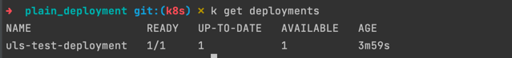
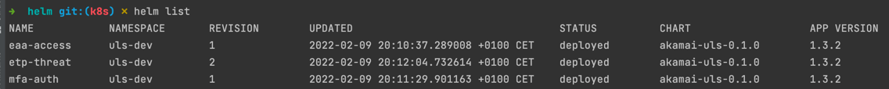

# ULS Kubernetes (K8s) Usage

This document describes the "kubernetes usage" of the ULS software.  

As k8s is a incredible flexible platform, we decided to provide a simple deployment example of ULS within a k8s cluster as well as a Helm Chart for more flexible usage.

## Plain kubernetes deployment
The whole file is only meant as an example to get you started configuring the ULS deployment to your needs.  
Feel free to amend additional configurations like "node pinning, resource limits" and others to the deployment.

An example deployment.yaml file can be found [here](examples/kubernetes/plain_deployment/)

## Helm Chart deployment
Using helm is a much more straight forward way (and also a standardized way) to deploy workloads into k8s.  
We are not (yet) providing a Chart repo - but we are providng the chart itself by now.  
Feel free to have a [look here](examples/kubernetes/helm/).  

