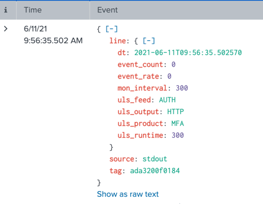

# ULS Monitoring
This document describes the ULS monitoring produced on the standard output.  
The output will be sent every 5 minutes to `stdout` by default.

## Field description
| Field                   | Example                    | Description                                                     |
|-------------------------|----------------------------|-----------------------------------------------------------------|
| dt                      | 2021-06-09T08:15:35.092889 | Date & Time (local OS Timezone)                                 |
| uls_product             | ETP                        | Selected ULS product                                            |
| uls_feed                | THREAT                     | Selected ULS feed                                               |
| uls_output              | HTTP                       | Selected ULS output                                             |
| uls_version             | 1.3.0                      | Version of ULS currently running                                |
| uls_runtime             | 3000                       | Time in seconds ULS is running                                  |
| event_count             | 625014                     | # events handled by ULS (overall)                               |
| event_count_interval    | 32145                      | # events sent to the Output by ULS (during the interval)        |
| event_ingested_interval | 32145                      | # events consume from the Input CLI                             |
| event_bytes_interval    | 12345679                   | Volume of events handled by ULS, in bytes (during the interval) |
| event_rate              | 10.97                      | Average events per second (during monitoring interval)          |
| mon_interval            | 300                        | Monitoring interval in seconds                                  |


## Example Output
The output is delivered in JSON format
```json
{"dt": "2022-07-11T20:59:48.511534", "uls_product": "EAA", "uls_feed": "ACCESS", "uls_output": "HTTP", "uls_version": "1.5.0", "uls_runtime": 300, "event_count": 635450, "event_count_interval": 635450, "event_ingested_interval": 635451, "event_bytes_interval": 602300990, "event_rate": 2118.17, "mon_interval": 300}
{"dt": "2022-07-11T21:04:48.511982", "uls_product": "EAA", "uls_feed": "ACCESS", "uls_output": "HTTP", "uls_version": "1.5.0", "uls_runtime": 600, "event_count": 1099860, "event_count_interval": 464410, "event_ingested_interval": 464409, "event_bytes_interval": 440221417, "event_rate": 1548.03, "mon_interval": 300}
```

## Send Docker logs to Splunk
For this we're using the embedded docker - Splunk logging module.

### Docker-compose
Example (add to every service in your `docker-compose.yml`)
```yaml
version: "3.0"
...
services:
  uls-tool:
    logging:
        driver: splunk
        options:
          splunk-url: 'https://your.splunk.host:8088'
          splunk-token: 'xxxxxxxxx-xxxx-xxxx-xxxx-xxxxxxxxxxxxx'
          splunk-insecureskipverify: 'true'
          splunk-format: 'json'
  ...
```

### Docker.compose template
https://github.com/compose-spec/compose-spec/blob/master/spec.md#using-extensions-as-fragments
```yaml
version: "3.0"
x-logging: &default-logging
  driver: splunk
  options:
    splunk-url: 'https://your.splunk.host:8088'
    splunk-token: 'xxxxxxxxx-xxxx-xxxx-xxxx-xxxxxxxxxxxxx'
    splunk-insecureskipverify: 'true'
    splunk-format: 'json'
...
services:
  uls-tool1:
    ...
    logging: *default-logging
    ...
  uls-tool2:
    ...
    logging: *default-logging
    ...
  ...
```

More Splunk - options for docker can be found [here](https://docs.docker.com/config/containers/logging/splunk/)
Sidenote: you will still receive logs on the CLI running `docker-compose logs -f uls-tool`



## Docker logs to other SIEMs
If you have other siem, please see dockers logging capabilities [here](https://docs.docker.com/config/containers/logging/configure/).