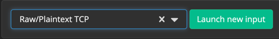

# GRAYLOG
This document describes how to configure [Graylog](https://www.graylog.org/) in order to receive data from ULS.
The recommended way is the Raw/Plaintext TCP Input.

## INPUT CONFIG 
### Raw/Plaintext TCP
Go to System -> Inputs and create a new Input:  

## FIELD EXTRACTION
As Extractor, you can use the "JSON" extractor using the standard settings.  
Eventually it is required to add additional JSON extractors for fields like "event_aupCategories", "query_resolved", ...  
Please see the [extractor documentation](https://docs.graylog.org/en/4.0/pages/extractors.html) for more help.

## KNOWN ISSUES

### Some fields are not getting extracted properly
See [this bug report](https://community.graylog.org/t/search-at-json-object-field/14735/6) within the graylog universe.