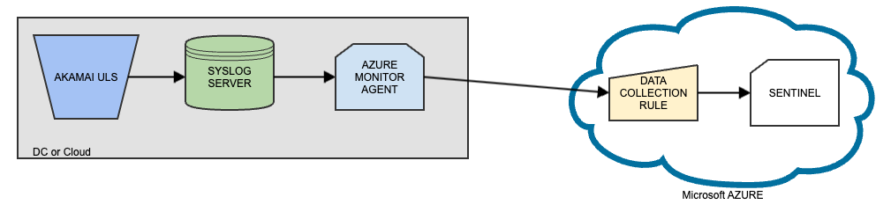

# Microsoft Sentinel
## Introduction
This document describes how to ingest data into [Microsoft Sentinel](https://learn.microsoft.com/en-us/azure/sentinel/overview) via the Akamai Unified Log Streamer (ULS).  
Here's an overview of the "processing" workflow


## Details
The currently recommended way is to feed ULS data into a UDP/TCP SYSLOG Server.   
The [Azure Monitor Agent](https://learn.microsoft.com/en-us/azure/azure-monitor/agents/agents-overview) collects the logs and ingests them into the Microsoft Sentinel platform.  
ULS and SYSLOG daemon do not need to reside on the same host.

### Steps to set up the conection 
#### Prerequisites
- Install [ULS](https://github.com/akamai/uls/tree/main#documentation) 
- Install a [SYSLOG server](https://www.syslog-ng.com/community/tags/install) (if not already comes with your system)
- Install the [Azure Monitor Agent](https://learn.microsoft.com/en-us/azure/azure-monitor/agents/agents-overview) ([MS ARC AGENT](https://learn.microsoft.com/en-us/azure/azure-arc/servers/deployment-options) might be required in order to install the Monitor Agent)

#### Configuration
- Syslog Server  
  Configure the Syslog server to accept logs via UDP or TCP (tcp is recommended)  
  Config Example for `RSYSLOG` Server
    ```editorconfig
    # TCP PORT (rsyslogd)
    module(load="imtcp")
    input(type="imtcp" port="514")
    ```

- ULS  
  Configure ULS to send the logs via OUTPUT TCP to the specified port (514 in that case).
  Example (fetching SIA/ETP THREAT logs):
  ```bash
  bin/uls.py --input ETP --feed THREAT --output TCP --hostname 10.9.8.7 --port 514
  ```

- Azure  
  A [Data Collection Rule](https://learn.microsoft.com/en-us/azure/azure-monitor/essentials/data-collection-rule-overview) needs to be deployed with the following configuration: 
  - Syslog Facility (e.g. LOCAL1)  pointing to the corresponding syslog facility the ULS streams the data into).
  - Log Transformation (Log Parsing)  

  As an alternative, here is a [working template](templates/AkamaiETPtableAndDCR.json) that can be [directly imported](https://urldefense.com/v3/__https:/learn.microsoft.com/en-us/azure/azure-resource-manager/templates/quickstart-create-templates-use-the-portal__;!!GjvTz_vk!SRr0pX7Yrgot61PaNJRTJU58jBwERmvbIH2uPFRKwWkYsPM13XYV0MSQ_Kxg1rqKwVjmnOMqORdyCxi4YL2XS2EE$).
  