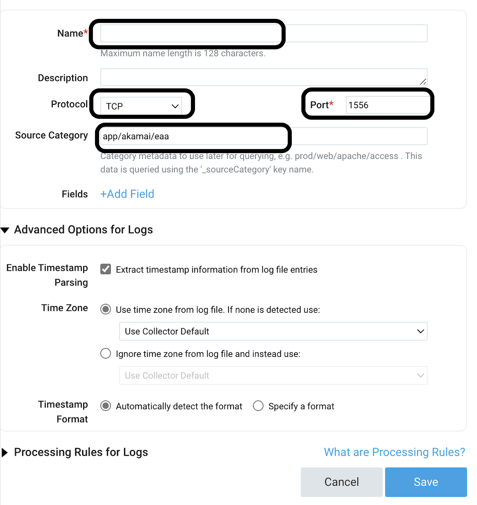

# SUMOLOGIC
This document describes how to configure [SUMOLOGIC](https://www.sumologic.com/) in order to receive data from ULS.
The recommended way is the TCP (Syslog) collector.

### STEPS
1. Create or use an existing [installed collector](https://help.sumologic.com/01Start-Here/Quick-Start-Tutorials/Set-Up-Sumo-Logic-Tutorial/Lab-1%3A-Install-a-Collector#:~:text=Sign%20in%20to%20Sumo%20Logic%27s%20training%20environment%2C%20if,right%20corner%2C%20click%20Add%20Collector%20Click%20Installed%20Collector) on a Linux machine or use an existing syslog collector machine (Cloud or on prem).
2. Create a [syslog source](https://help.sumologic.com/03Send-Data/Sources/01Sources-for-Installed-Collectors/Syslog-Source) on the collector.
    - Go to Collector settings on Sumo Logic UI, and select "Add source". 
    - Select "Syslog Source" from the platform sources. 
    - Fill out the required fields, and type a TCP port that is not used by any other application on the collector installed machine.

     
3. [Install the ULS script](https://github.com/akamai/uls/blob/main/docs/COMMAND_LINE_USAGE.md#:~:text=%20Installation%20%201%20Clone%20ULS%20Repo.%20Clone,ULS%20will%20run%20in%20foreground%20and...%20More%20) and it's dependencies.

4. Run this sample command on the Sumo Logic console. Make sure the port number has to be same as the listening port on Sumo Logic syslog source.

    ```bash 
    python3 uls.py --input eaa --output tcp --host 127.0.0.1 --port 1556
    ```